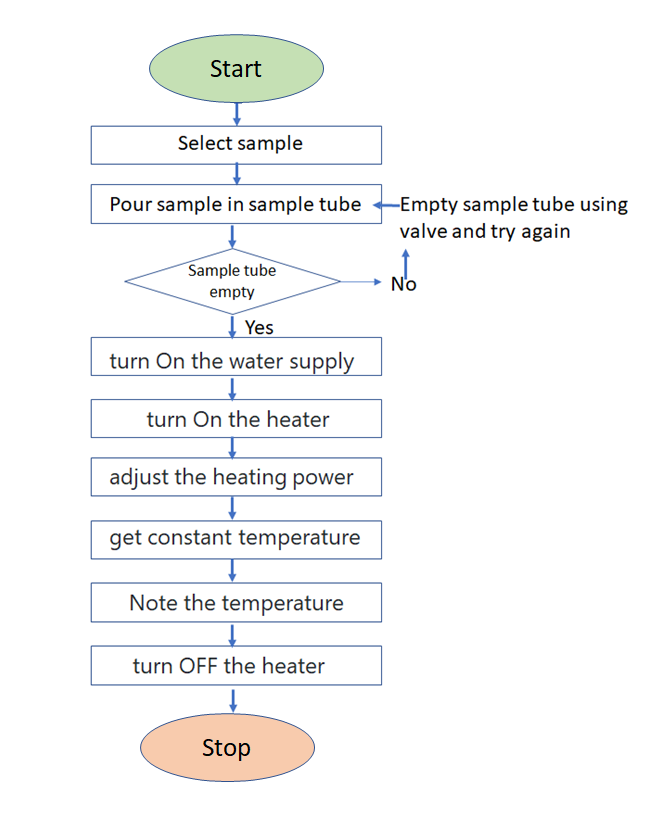
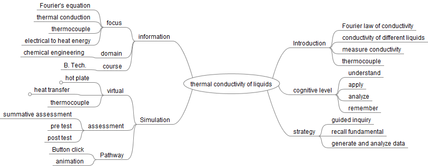
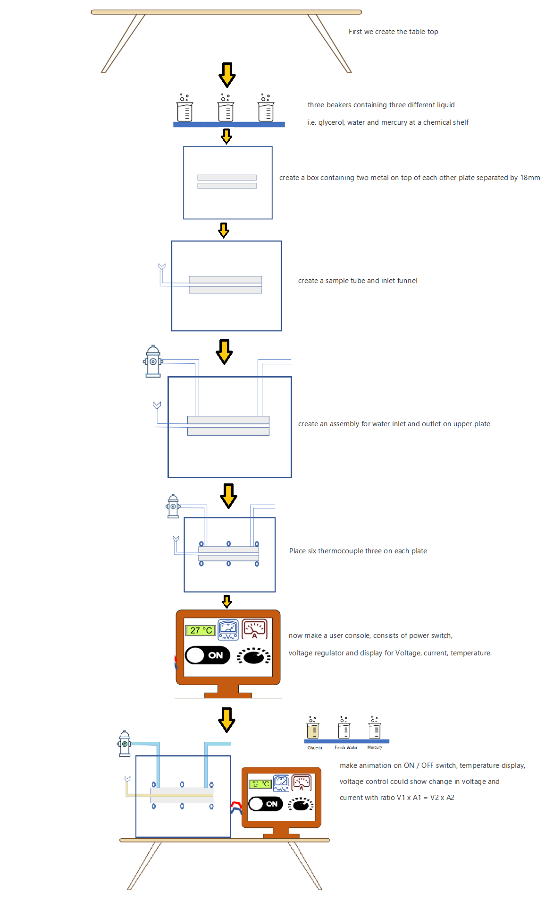

## Storyboard (Round 2)

Experiment 1: To find out the thermal conductivity of liquids

### 1. Story Outline:

The experiment is based on the Fourier law. It involves the heat conduction through sample liquid filled between two metal plates of different temperature. Hot plate is heated up using electric current and cold plate is cooled using cold water supply. Both plates contain three thermocouple each to measure temperature. The experiment is used to measure thermal conductivity of different liquids and verify heat transfer law.

### 2. Story:

First the user will select the liquid. Then pour liquid in sample tube. The user will open the valve at the inlet of the cooling water jacket and maintain constant water flow rate. The user turns on the switch on the heater. Now user set the heat controller or voltage regulator which adjusts power input to heater. Wait till the temperatures of both plates are constant with time that is steady state is reached (timer for 15 sec start). Read the temperatures on digital temperature indicator (temperature of both plates will display for 3 sec).

#### 2.1 Set the Visual Stage Description:
In the simulator user will be able to see the virtual prototype of experimental setup resembling the actual experiment setup. Setup consists of two metal plates of 100mm diameter placed at top of each other separated by 18mm width. The sample liquid is filled in the space between plates called sample tube. Six thermocouples are splaced on the plates (three each) to measure temperature of the plates. A heating unit which provides heat to the lower metal plates using electrical energy. The user console provided with power switch, voltage regulator and display for Voltage, current, temperature.
  
#### 2.2 Set User Objectives & Goals:

1. To verify the Fourier law of conductivity
2. calculate and compare the thermal conductivity of different liquids.
3. classify material on basis of conductivity.

#### 2.3 Set the Pathway Activities:

1. The simulator setup is provided with user instruction to guide the user. 
2. Instruction “select a sample liquid” shown near the chemical shelf 
3. User click on one of the sample by click on it. 
4. Instruction “pour the sample” shown near the funnel 
5. User drag the braker to the funnel 
6. Animation of pouring start automatically 
7. Instruction “turn On the water supply” shown near the water inlet 
8. User tern on water supply by a click 
9. Instruction “turn On the heater” shown near the User console 
10. User switch On by click 
11. Instruction “adjust the heating power” shown near the User console pointing towards Voltage regulator 
12. User rotate / slide the Voltage regulate to adjust voltage (current also change simultaneously) and click Ok when he is ready 
13. Instruction “now wait to get constant temperature” shown near the User console, a timer of 15 sec appears 
14. As timer closes, Instruction “Note down the temperature of hot and cold plate” 
15. User calculate the Thermal conductivity of Liquid using formula 

##### 2.4 Set Challenges and Questions/Complexity/Variations in Questions:

1. Describe what is meant by thermocouple? 
  a) Junction of two metal rods 
  b) the place where two bodies of different temperature are connected. 
  c) The sensor which detect the temperature change 
  d) The combination of conductor and insulator 

2. The thermocouple works on the principle of – 
  a) Peltier effect  
  b) Lorenz effect  
  c) Fourier effect  
  d) Wein’s effect  
  
Explanation: A thermocouple is known as the tool which senses the temperature change. The thermocouple is based on the Peltier effect. The temperature difference is produced by the exchange of heat between electric junctions. 

3. “Thermal conductivity represents the amount of heat conducted across the unit area when a temperature difference of one kelvin”. 
  a)True 
  b)False 
  
Explanation : thermal conductivity is amount of heat conducted across unit area and through unit distance. 

4. The thermal conductivity and the electrical conductivity of a metal at absolute temperature are related as 
  a)k/σ T 
  b)k/σ 
  c)k σ/T 
  d)k/T 

Answer (a) It is defined as the ratio of thermal conductivity to the product of electrical conductivity and temperature. 

##### 2.5 Allow pitfalls:
If user do not turn off the heater, before his further reading, the simulator will blow off. 
If user do not release previous liquid from sample tube and try to add new liquid, the simulator will blow off. 

##### 2.6 Conclusion:
User will take approximately 10 minutes for understanding the procedure. The data generation through simulator require 4-5 minutes. Further user require 15 minutes to complete the calculation and plotting graph. So, total time taken to complete experiment is 30 minutes.

##### 2.7 Equations/formulas: NA
The following formula are used in calculation:
The heat balancing equation for one dimensional flow is given by, 
For thermal conductivity of liquids using Fourier's law, the heat flow through the liquid from hot fluid to cold fluid is the heat transfer through conductive fluid medium. Fourier's equation

Q = -k A d t /d x.

Or 

Q = -k A (T2-T1) /d x.

Where 
K = Thermal conductivity of Liquid in W/m2C 
A = Area of the cylinder in m2 (A = πr2, r is radius of plate)
ΔT/ΔX = Temperature slope
q = heat supplied ( V x i )

### 3. Flowchart 4
 

### 4. Mindmap:

### 5. Storyboard :

